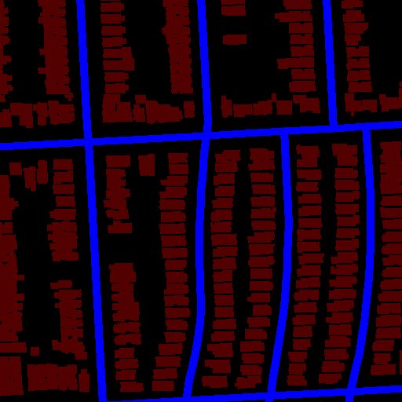
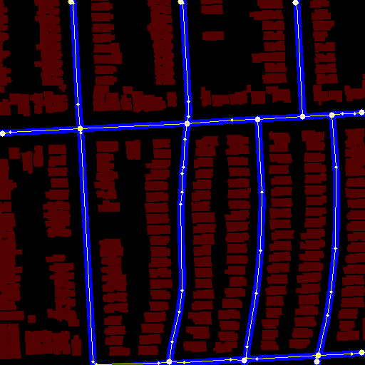
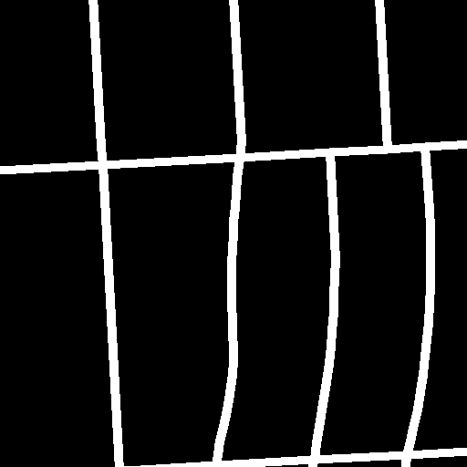
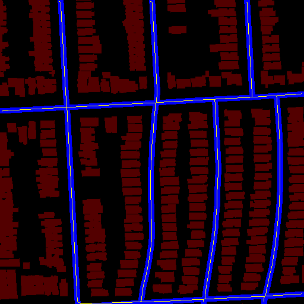
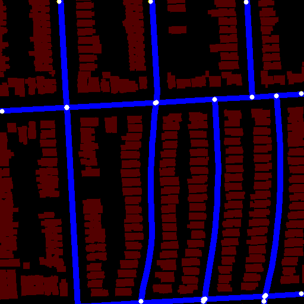
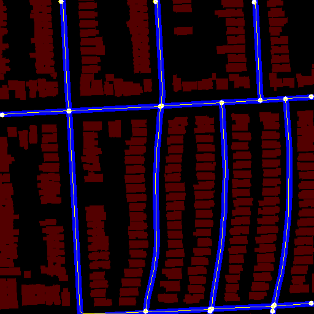
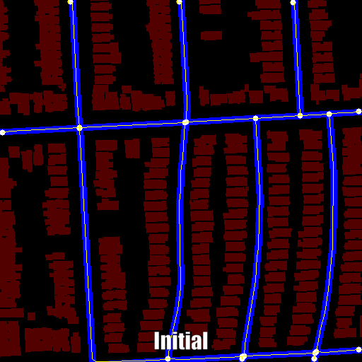

# Extract Raster Network

Extract a network graph (nodes and edges) from a raster image.
See this [Stack Overflow question][1] for details.

## Quickstart

    python3 -m venv venv
    source venv/bin/activate
    pip install -r requirements.txt
    ./extract_network.py samples/grid1.png '(0, 0, 255)'

## What this does

This takes a raster (PNG) image containing some kind of network (e.g. a street grid):

and finds the nodes (e.g. intersections) and edges between them (e.g. streets):

Here the large circle are extracted nodes and the lines and small circles indicate the
extracted polylines for the edges between them.

Here are some more complex examples including multiple paths between two nodes and a
self-loop:

## Algorithm

The general approach is:

1. Binarize the image by finding pixels matching a specific color.
2. [Skeletonize][skel] the image to make the "streets" 1px wide.
3. Find candidate nodes (see below).
4. Repeat until no two nodes are too close together:
   1. Use breadth-first search (flood fill) to connect nodes.
   2. If two connected nodes are within D of each other, merge them.
5. Run shapely's [`simplify`][simplify] on the paths between nodes to get polylines.

"Find candidate nodes" and "Use breadth-first search" are the interesting bits.
This code largely follows the approach from [NEFI][] with a few modifications:

- This uses the "Zhang-Suen" nodes (those with exactly 1 or 3+ neighbors) as a
  starting point (same as NEFI). This depends heavily on the skeleton being _exactly_
  1px wide, which is not always the case for complex intersections. To address this
  situation, we add candidate nodes at locally dense (2x2 or larger) locations in the
  skeleton.

- We do a breadth-first search from the candidate nodes, same as NEFI.
  The departures are that we:
  - Allow self-loops and multiple edges between the same pair of nodes.
    The image below contains examples of both of these.
  - Iteratively merge nodes that are too close to one another.

The final shapely `simplify` step does not change the network topology but is convenient
for visualizing and working with the resulting polyline.

### Visualization of the steps

Starting image is the same as above ([`grid1.png`](/samples/grid1.png)).

Here's the binarized version:

Here's the result of skeletonization (yellow line overlaid on the original image):

Here are the Zhang-Suen nodes:

It's a bit hard to see because the nodes are so close together, but there are two nodes
at the four-way intersection in the center of the image and three nodes at two of the
four-way intersections at the bottom of the image. These will have to be merged later.

Here's the results of the initial breadth-first search (flood fill):

Not bad! Now it's time to merge nearby nodes. First the duplicated nodes at the four-way
intersection in the middle-left of the image, which are only 1px apart, and then the one
in the center of the image:

    Merged (112, 180) and (112, 181), d=1
    Merged (261, 173) and (263, 172), d=2

Here's a GIF showing the results of these two merges:

This repeats until no nodes are left to merge:

At this point we have all our nodes and edges. But the paths are long sequences of 1px
segments. For example:

    > path.wkt
    LINESTRING (173 262, 172 263, 172 264, 172 265, 172 266, 172 267, 172 268, 172 269, 172 270, 172 271, 172 272, 172 273, 172 274, 172 275, 171 276, 171 277, 171 278, 171 279, 171 280, 171 281, 171 282, 171 283, 171 284, 171 285, 171 286, 171 287, 171 288, 171 289, 171 290, 171 291, 171 292, 170 293, 170 294, 170 295, 170 296, 170 297, 170 298, 170 299, 170 300, 170 301, 170 302, 170 303, 170 304, 170 305, 170 306, 170 307, 170 308, 169 309, 169 310, 169 311, 169 312, 169 313, 169 314, 169 315, 169 316, 169 317, 169 318, 169 319, 169 320, 169 321, 169 322, 169 323, 169 324, 168 325, 168 326, 168 327, 168 328, 168 329, 168 330, 168 331, 168 332, 168 333, 168 334, 168 335, 168 336, 168 337, 168 338, 168 339, 168 340, 168 341, 167 342, 167 343, 167 344, 167 345, 167 346, 167 347, 167 348, 167 349, 167 350, 167 351, 167 352, 167 353, 167 354, 167 355, 167 356, 167 357, 167 358, 167 359, 167 360, 167 361)

Using shapely's simplify greatly shrinks this with little loss of information. In fact,
it may be a better reflection of the street's true (vector) shape before rasterization:

    > path.simplify(1).wkt
    LINESTRING (173 262, 168 325, 167 361)

Here's the final result:

## References

- [Stack Overflow question][1]
- [NEFI2][2], a GUI app for Network Extraction. See also [their 2018 paper][3].

[1]: https://stackoverflow.com/questions/69398683/extract-street-network-from-a-raster-image
[2]: https://github.com/05dirnbe/nefi
[3]: https://arxiv.org/pdf/1502.05241.pdf
[skel]: https://scikit-image.org/docs/stable/auto_examples/edges/plot_skeleton.html
[simplify]: https://shapely.readthedocs.io/en/stable/manual.html#object.simplify
[nefi]: https://github.com/05dirnbe/nefi/blob/260b2717ebc5fb94b2a241c5b73540b41f3dc6bf/nefi2/model/algorithms/guo_hall.py#L63
